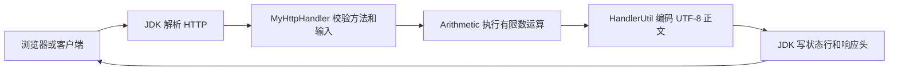

# 实验一：读懂一次 HTTP 请求

先运行服务，再打开首页。输入 7、8 并选 GET，你会看到路径 `/add/7/8` 和正文 `15.0`。切换 POST 后，参数进入 JSON，返回值也进入 JSON。

## 协议和业务各负责什么



`HttpExchange.sendResponseHeaders` 已负责 HTTP 协议头。往正文再次写入 `HTTP/1.1 200 OK` 会让浏览器看到多余文本，也使 JSON 解析失败。修复后，`Content-Length` 是 UTF-8 **字节数**，响应体只承载业务结果。

## 算术接口

| 请求 | 成功正文 | 说明 |
| --- | --- | --- |
| GET `/add/{a}/{b}` | `15.0\n` | 加法 |
| GET `/subtract/{a}/{b}` | 一个有限数加换行 | 减法 |
| GET `/multiply/{a}/{b}` | 一个有限数加换行 | 乘法 |
| GET `/divide/{a}/{b}` | 一个有限数加换行 | 除法，除数不可为正负零 |
| POST `/` 或 `/calculate` | `{"result":3.0}\n` | 使用 JSON 请求 |
| GET `/` 或 `/demo` | HTML | 浏览器实验界面 |

POST 示例：

```json
{"operation":"divide","arguments":[9,3]}
```

字段名和运算名兼容大小写；字段必须恰好是 `operation` 和 `arguments`，顺序不限。数值必须是 JSON 数字，不能使用字符串、null、NaN 或 Infinity。参数数组恰好两个元素。重复字段、额外字段、单引号、注释、尾随 JSON 值均不接受。

GET 的数字遵循 Java `Double.parseDouble` 语法，并额外要求有限输入和有限结果。当前不解析运算路径中的百分号编码，也不使用查询串作为算术参数。所有计算为 `double`，不适合要求十进制精确性的金额计算。

## 错误契约

| 状态码 | 触发条件 |
| --- | --- |
| 400 | JSON 或 UTF-8 无效、缺少参数、除零、非有限输入或结果 |
| 404 | 未知路由或 GET 运算 |
| 405 | GET/POST 以外的方法，响应带 `Allow: GET, POST` |
| 413 | POST 正文超过 8192 字节 |
| 415 | 提供了非 `application/json` 的 Content-Type |

POST 为兼容旧调用允许缺省 Content-Type；新代码应始终发送 `application/json`。成功 JSON 为 `application/json; charset=utf-8`；错误正文为 `text/plain; charset=utf-8`。客户端应先检查状态与类型，不能无条件把所有响应当 JSON。HEAD 被拒绝为 405，但不发送正文。

响应禁止缓存并携带 `nosniff`。当前设计每次响应后关闭连接，方便观察生命周期。没有加入 CORS，浏览器示例从同源服务获取结果。

## 阅读源码

1. `Arithmetic.java` 仅负责运算，可脱离网络理解。
2. `MyHttpHandler.java` 是输入边界；对 JSON 使用严格的 `JsonReader`，而不是 Gson 的宽松自动解析路径。
3. `HandlerUtil.java` 专门写响应，不在失败后递归尝试再发送一份响应。
4. `ServerRuntime.java` 拥有监听器和线程池。

协议原文可查 [RFC 9112：HTTP/1.1](https://www.rfc-editor.org/rfc/rfc9112.html)。读它时先关注消息结构、Content-Length 和连接关闭，不必一次通读全文。
